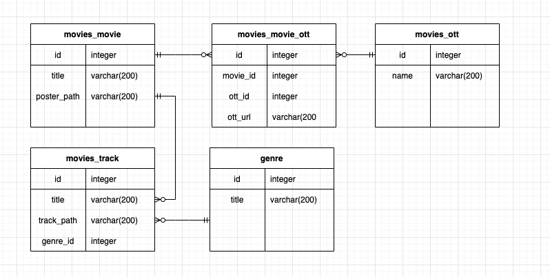
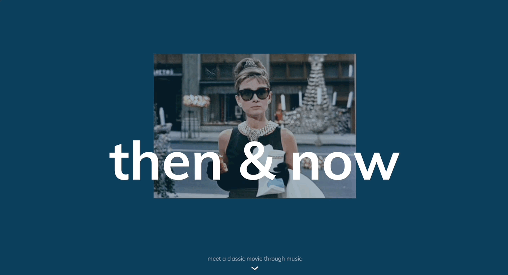
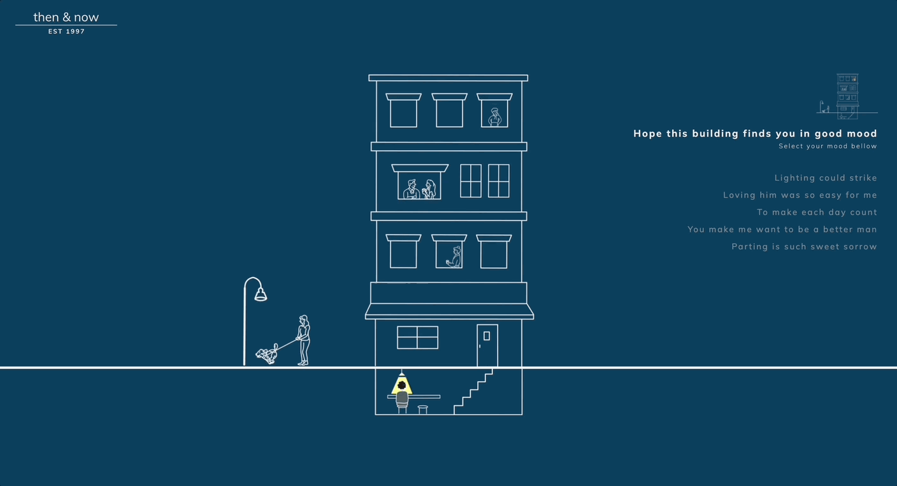
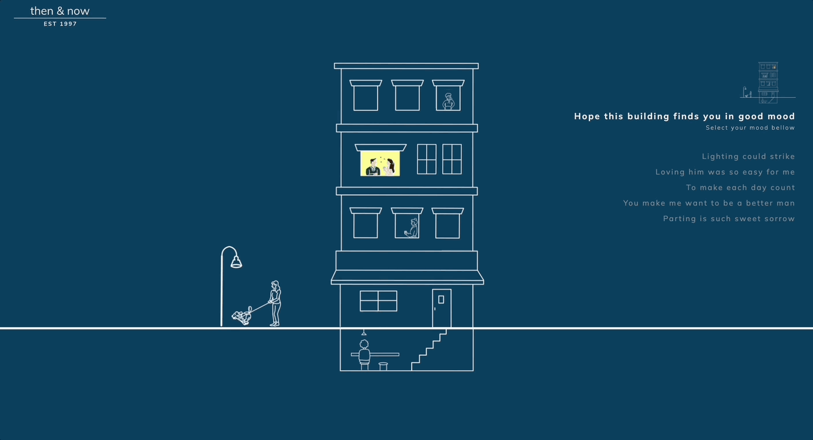
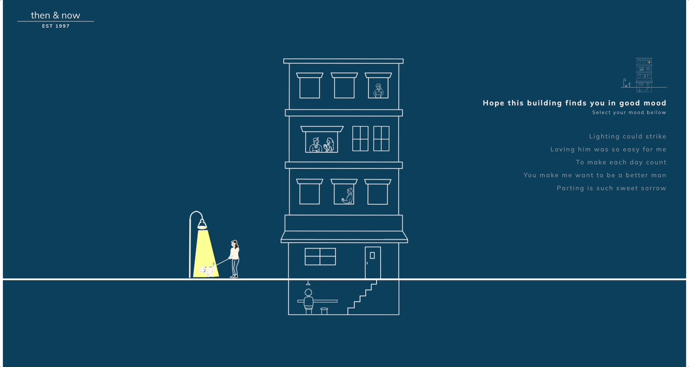
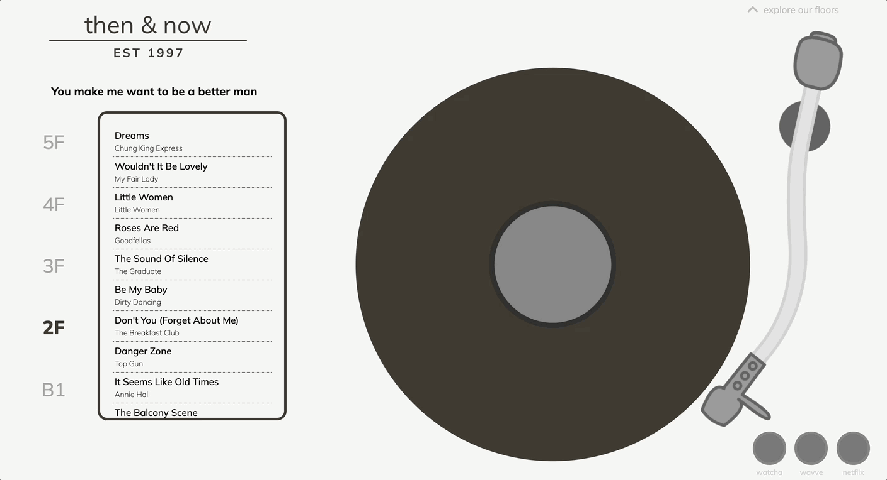
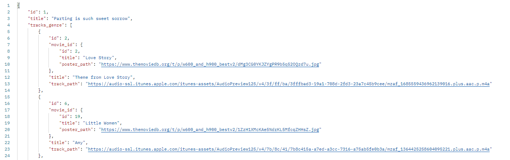
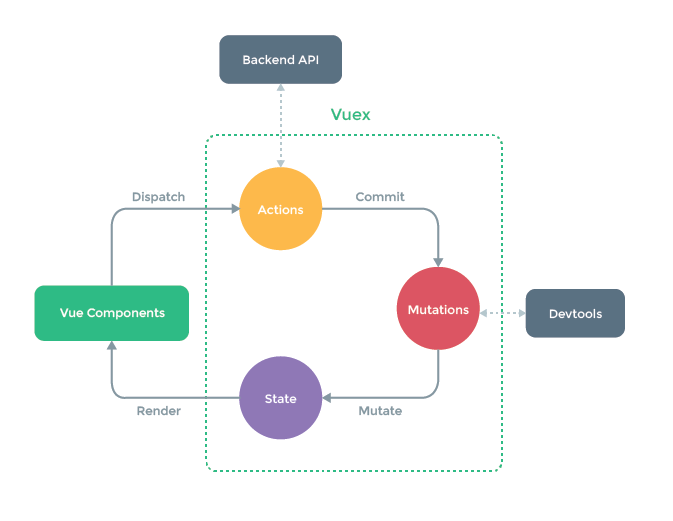
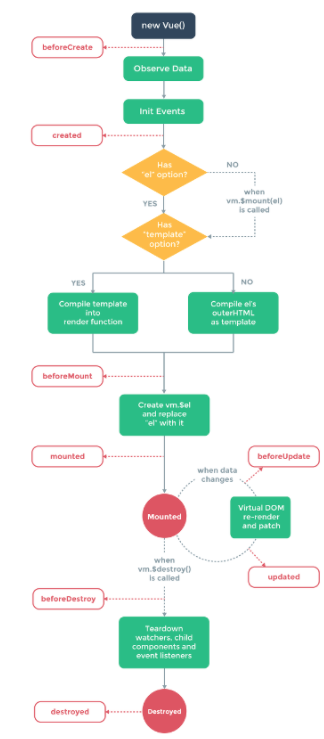

<h1 align="center"> Then & Now 🎬</h1>

 >**OTT 유입을 위해 시각적이고 음악적인 요소를 활용한 고전 영화 콘텐츠 추천 서비스**

 > 사이트 이동: https://boring-swartz-cc943b.netlify.app/

</hr>
</br>
<h2 >Contents</h2>

[**1. 🌱 Background**](#1)

[**2. Introduce Project**](#2)

​	[**- 👬 Team Members**](#3)

​	[**- 🧾 Team Rules**](#4)

​	[**- 🛠 Languages and Tools**](#5)

​	[**- 📚 Architecture Diagrams**](#6)

[**3. 💡 Main Function**](#7)

[**4. 💻 Installation**](#8)

[**5. 🤔 Retrospect**](#9)

<hr/>

<br/>
<div id="1"></div>

## 🌱 Background

<h3 align="center">"오래봐야 사랑스럽다 이 영화도 그렇다."</h3>
<br/>

### 1) MZ세대가 경험하는 코로나 블루 힐링에 대한 필요성

MZ세대의 정신 건강 및 스트레스 관리 활동은 ‘맛있는 음식이나 음료 즐기기(51.1%)’나 **‘콘텐츠 소비하기(49.2%)’**와 같은 소비 활동이 가장 높게 나타났다. 이어서 ‘스트레스나 고민거리를 나눌 수 있는 사람과 시간 보내기(35.9%)’, ‘생각을 비우고 차분해지는 시간 갖기(35.7%)’도 관리 활동의 일종으로 나타났다.


### 2) 뉴트로 트렌드 및 취향소비와 더불어 레트로 LP에 대한 관심 지속

반면, ‘나만의 것’을 원하는 개성·취향 존중의 ‘가치 소비’가 밀레니얼 세대의 특징이다. 현재의 스타일이 흔해지고 지루해졌다고 느끼는 MZ세대가 많다. 과거의 낡고 촌스럽다고 여겨졌던 것들이 현대적으로 재해석된 레트로 감성은 그 시절을 경험해보지 못한 **이들에게 ‘신선함’으로 다가온다.**
<br/>
<hr/>
<br/>

<div id="2"></div>

## 🎥 Introduce Project

오늘 하루를 고생한 당신을 위해 제작한 프로젝트입니다.

***당신의  오늘하루는 어떠셨나요?*** 

이 건물을 통해 당신의 기분이 좋아질 수 있기를 바라 봅니다.

오늘의 **기분**과 가장 비슷한 문구를 통해 음악을 감상하고 아름다웠던 그 시절의 **고전 영화**로 하루를 마무리하세요 : )

<br/>
<hr/>
<br/>

<div id="3"></div>

## 👬 Team Members

<h4 align="left"> 👋 Hi , We're Sang Joon, Tae Yeon</h4>

|  이름  |             역할             |
| :----: | :--------------------------: |
| 김태연 |     김태연 ( Back-End )      |
| 손상준 | 손상준 ( Front-End, Deploy ) |
<br/>
<div id="4"></div>

## 🧾 Team Rules

### 1. Git Rules

깃에 파일을 커밋 전에 꼭 `git status` 명령어를 통해 커밋하길 원하는 파일들만 `Staging area`로 넘어가는 것인지 꼭 확인하고 커밋 해주세요.
기본적으로 커밋 메시지는 아래와 같이 제목/본문으로 구성합니다.
> 예시) Feat : 로그인 기능 구현

<br/>

### 2. Commit Type

|   Type   |                내용                |
| :------: | :--------------------------------: |
|   Feat   |          새로운 기능 추가          |
|   Fix    |             버그 수정              |
|  Revise  |          오타, 코드 수정           |
|   Docs   |         문서 작성 및 수정          |
|  Style   |            웹 스타일링             |
| Refactor |           코드 리펙토링            |
|  Chore   | 빌드 업무 수정, 패키지 매니저 수정 |

<br/>
<hr/>
<br/>
<div id="4"></div>

## 🛠 Languages and Tools

##### Back- End : 

#####   

##### Front-End : 

#####    


<div id="5"></div>

## 📚 Architecture Diagram

|                          ERD                         |
| :-----------------------------------------------------------: |
|  |


|                            랜딩페이지                            |네비게이션 페이지                        |메인페이지                        |
| :---------------------------------------------------------: |:---------------------------------------------------------: | :---------------------------------------------------------: |
|  |  | |

<div id="5"></div>

## 💡 Main Function

### 1. 네비게이션 페이지

|                            네비게이션                            |페이지 이동                       |
| :---------------------------------------------------------: |:---------------------------------------------------------: |
|  | |

### 2. 메인 페이지

|                          장르 변경                         |
| :-----------------------------------------------------------: |
|  |

|                          영화 OST 선택                         |
| :-----------------------------------------------------------: |
|  |

|                          영화 OST 재생 / 멈춤                         |
| :-----------------------------------------------------------: |
|  |

|                          영화 OST 변경                       |
| :-----------------------------------------------------------: |
|  |


|                          영화 콘텐츠 OTT 이동                       |
| :-----------------------------------------------------------: |
|  |


## 💻 Installation

### Version

|  목록   |  버전   |
| :-----: | :-----: |
|   npm   | 8.1.0 |
| node.js | 16.13.0 |
| python  | 3.9.9 |
| Djnago | 3.2.3 |

### Django
1. 마이그레이션 파일 생성
> $ python manage.py makemigrations
2. 마이그레이션 적용
>$ python manage.py migrate
3. admin 관리자 생성
> $ python manage.py createsuperuser
4. DB 채우는 방법
>admin 관리자로 로그인 후,<br/>
 Movie -> Ott -> Genre -> Movie_ott, Track 모델 순으로 xlsx 파일 import 진행

### Vue.js
1. 필요한 node_modules 설치
> $ npm install
2. 뷰(클라이언트) 앱 실행
>$ npm run serve


## 🤔 Retrospect

### **태연**

Front에서 원하는 데이터를 기준으로1) Genre를 기준으로 영화의 ost정보를 포함하는 Track의 정보, 2) Movie의 정보 두 가지의 데이터를 API를 통해 보내줘야 하기 때문에, M:N관계로 이루어진 모델을 이용하여 Serializer ( GenreListSerializer, MovieSerializer) 를 생성하였습니다.

M:N으로 이루어진 Genre, Movie의 두 모델의 관계를 통해 중개 테이블인 Track의 정보를 뽑기 위해서는 역참조를 사용하였으며, 중첩된 형태로 데이터를 뽑아내기 위해서 DRF에서 Nested Serializer을 사용했습니다.

1:N의 관계로 Genre를 기준으로 related_name으로 연결된 Track모델의 genre_id와 연결을 시키고 Movie기준으로 두개의 부모가 존재하기 때문에 Nested Serializer을 사용했습니다.


```python
   def to_representation(self, instance):
     response = super().to_representation(instance)
     response["movie_id"] = MovieSerializer(instance.movie_id).data
     return response
```

 

to_representation을 이용하여 Genre를 기준으로 트랙을 받아온 이후, 트랙이 가지고 있는 영화의 id정보를 통해 영화의 나머지 정보까지 받아올 수 있었습니다. related_name을 이용한 역참조 방법과, 1:N관계를 지닌 Movie: Track의 관계를 통한 Nest Serializer방법을 학습 할 수 있었습니다.

2주 간의 프로젝트를 진행하면서 기획부터 배포까지 전반적으로 흘러가는 모든 과정을 경험해볼 수 있었다. 기획을 처음에 전체적으로 구성을 해두고 시작하니까 모델의 변경도 없고 코드를 구성하는데 있어 훨씬 수월했던 것 같다. 실수로 인해 정말 간단한 오류였지만 해결을 못해서 힘들었던 경험도 있었지만 하나하나 해가면서 성장할 수 있었던 시간이었고, 특히 팀원인 상준님과 함께해서 든든했다 ^&^

<br/>
<br/>

### **상준**

Vuex를 활용해서 Vue의 상태관리와 라이프사이클을 이해하게 된 프로젝트 였습니다.
Dipatch를 통해 Action를 호출하고, Commit을 통해 Mutation을 호출하고 이후 State를 변경하는 과정을 이해하게 되었습니다. 

|                            Vuex                            |Vue                        |
| :---------------------------------------------------------: |:---------------------------------------------------------: |
|  |  |


State를 관리하면서, Vue 컴포넌트의 라이프사이클에 대한 이해를 바탕으로 화면을 구현할수 있었습니다.
```javascript
  computed: {
    ...mapState(["onHover"]),
    ...mapGetters(["isHover"]),
  },
  watch: {
    isHover: function () {
      this.activeImage = [false, false, false, false, false, false];
    },
  },
  mounted() {
    this.landing = setInterval(this.activateImage, 1000);
  },
```

리엑트에서 상태관리와 컴포넌트 라이프 사이클에 대해 이해가 조금 부족하다고 생각했는데, Vue를 사용하면서 조금은 다르지만 직관적으로 이해를 하게 된 계기가 되었습니다. 태연님이랑 함께 프로젝트를 하게되면서 즐겁게 효율적으로 완성도 높은 프로젝트를 할 수 있어서 좋았습니다.